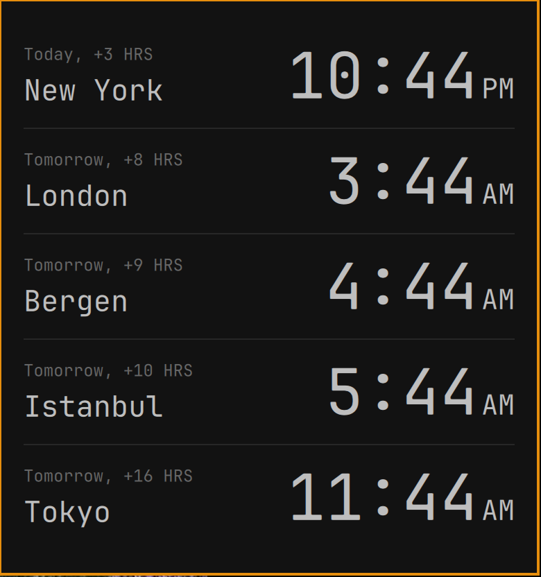

# Omarchy World Clock



A personal Omarchy bar plugin by Ali. Click the globe for a simple city list:
large times, AM/PM, day relative to home, and the current offset from home.
The panel follows your theme. No network, accounts, or third-party plugin code.

Requires Omarchy Quattro (Omarchy 4), Python 3, and the system IANA timezone
database (`tzdata`). No pip packages, install hooks, or build steps are needed.
Clocks refresh on opening and every minute while open, including DST changes.
Home follows your system timezone. Escape/outside-click closes the panel;
Scroll or Up/Down moves through longer lists. Tab focuses the header actions.
Right-click the globe for **Use 12/24-hour time**.
The time format is saved in `shell.json`.

## Edit cities in the widget

1. Open the globe and choose **Edit** in the main view.
2. Edit rows show the day/offset above each city, with a red **−** on the left
   to remove it and a drag grip on the right. Longer lists scroll.
3. Choose **+** from either the main or edit view to open a separate city
   search screen. Search a city or IANA timezone and select a result (or press
   Enter) to add it to the draft, returning to the edit view. **Back** returns
   without adding anything.
4. Drag a city's grip to reorder it. Long lists auto-scroll near the edges.
   Keyboard: Tab to a grip and use Up/Down. Escape cancels an active drag;
   dropping outside the list also cancels it.
5. Choose the highlighted **✓** to save the list and order. Escape in the edit
   view discards edits; Escape in search returns to the draft first.

Search works offline using system timezone locations, not an exhaustive city
directory. If your city is missing, search for a nearby city sharing its
timezone; display labels can also be customized in `shell.json`. The catalog
includes aliases for Bergen, Cupertino, and Mumbai. Already-added entries are
marked and cannot be added twice. Saving preserves other bar settings.
Lists use native Qt Quick scrolling, including touchpad inertia, without
intercepting wheel events. Drag-to-reorder auto-scroll remains direct.

## Install

```bash
omarchy plugin add https://github.com/alivault/omarchy-world-clock.git --enable
```

The globe appears in the right bar section. To move it there explicitly:

```bash
omarchy bar move ali.world-clock --section right
```

## Configure

Edit the `ali.world-clock` entry in `~/.config/omarchy/shell.json`:

```json
{
  "id": "ali.world-clock",
  "hourFormat": "12h",
  "zones": [
    { "label": "Home", "zone": "" },
    { "label": "Bergen", "zone": "Europe/Oslo" },
    { "label": "Tokyo", "zone": "Asia/Tokyo" }
  ]
}
```

Omit `zones` for New York, London, Bergen, Istanbul, and Tokyo. An empty zone
uses your system timezone; list order controls display order. Use `24h` to hide
AM/PM. Optional `fontFamily` defaults to the system bar font. Unknown zones show an em dash,
never a misleading local time. City labels are rendered as plain text.

Open from a command: `omarchy-shell shell summon ali.world-clock`

## Remove

```bash
omarchy plugin remove ali.world-clock
```

## Privacy and permissions

All time calculations run locally using Python's standard-library `zoneinfo`.
There are no network requests, credentials, telemetry, privileged operations,
or persistent background services. A short Python process runs when the panel
opens and each minute while it is open, and once to load the editor's timezone
catalog. Settings are saved through Omarchy's bar-settings CLI/IPC only after
choosing a time format or clicking the save checkmark; other user settings are left intact.

## Development

```bash
./check.sh
omarchy plugin validate .
```

Tests cover DST transitions, midnight/noon, fractional offsets, invalid zones,
12/24-hour formatting, and the default cities.

## License

[MIT](LICENSE).
